# Crypto Data Pipeline & Dashboard

This project is an end-to-end data engineering pipeline that collects real-time cryptocurrency data from the CoinGecko API, processes and stores it in a PostgreSQL database (Supabase), and presents insights through an interactive Streamlit dashboard. The pipeline is orchestrated and scheduled using Apache Airflow, showcasing a production-style data workflow from ingestion to visualization.

## Pipeline Architecture


---

## Tech Stack

| Technology | Purpose |
|---|---|
| Python | Core programming language for the pipeline |
| requests | Fetch data from the CoinGecko API |
| JSON | Store raw data files |
| pandas | Data cleaning and transformation |
| PostgreSQL | Cloud database for structured data |
| Supabase | Managed PostgreSQL hosting |
| SQL | Define schema and query data |
| SQLAlchemy | Database connection and ORM |
| psycopg | PostgreSQL driver |
| python-dotenv | Manage environment variables |
| Apache Airflow | Pipeline orchestration and scheduling |
| Streamlit | Build interactive dashboard |
| glob | Handle file selection (latest data) |
| datetime | Generate timestamps for data collection |

---

## How to Install and Run

### 1. Clone the repository
```bash
git clone https://github.com/khalidiktib/crypto-pipeline
cd crypto-pipeline
```

### 2. Create and activate virtual environment
```bash
python -m venv venv
venv\Scripts\activate
```

### 3. Configure environment variables
Create a .env file in the project root:
```bash
DATABASE_URL=postgresql+psycopg://connection-string
```

### 4. Install dependencies
```bash
pip install -r requirements.txt
```

### 5. Run the pipeline
Start Airflow services:
```bash
airflow webserver --port 8080
airflow scheduler
```
Then trigger the DAG from the Airflow UI:
```bash
http://localhost:8080
```

### 6. Launch the dashboard
```bash
streamlit run dashboard.py
```

## Live Demo

🌐[View Dashboard](https://crypto-pipeline-zjyqkesccvwuwpza7nw73q.streamlit.app/)

---

## What I Learned

- Built an end-to-end data pipeline (Extract → Transform → Load → Dashboard)
- Worked with REST APIs and handled real-world issues like network failures and API errors
- Cleaned and structured data using pandas for analysis and storage
- Migrated from SQLite to PostgreSQL (Supabase) for a scalable cloud-based solution
- Used SQLAlchemy and environment variables to manage database connections securely
- Implemented Apache Airflow for workflow orchestration and scheduling
- Organized a project into modular and reusable components
- Transformed data into insights through an interactive Streamlit dashboard

---


# Project Components
- Data Pipeline (ETL workflow)
- Raw Data Storage (JSON files)
- Data Transformation (pandas)
- Cloud Database (PostgreSQL - Supabase)
- Workflow Orchestration (Apache Airflow)
- Dashboard (Streamlit)
- Documentation (README)

---

